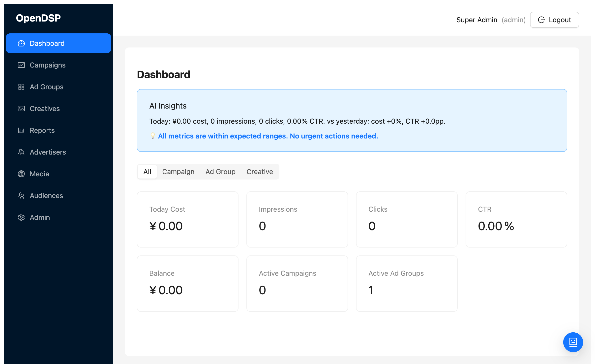
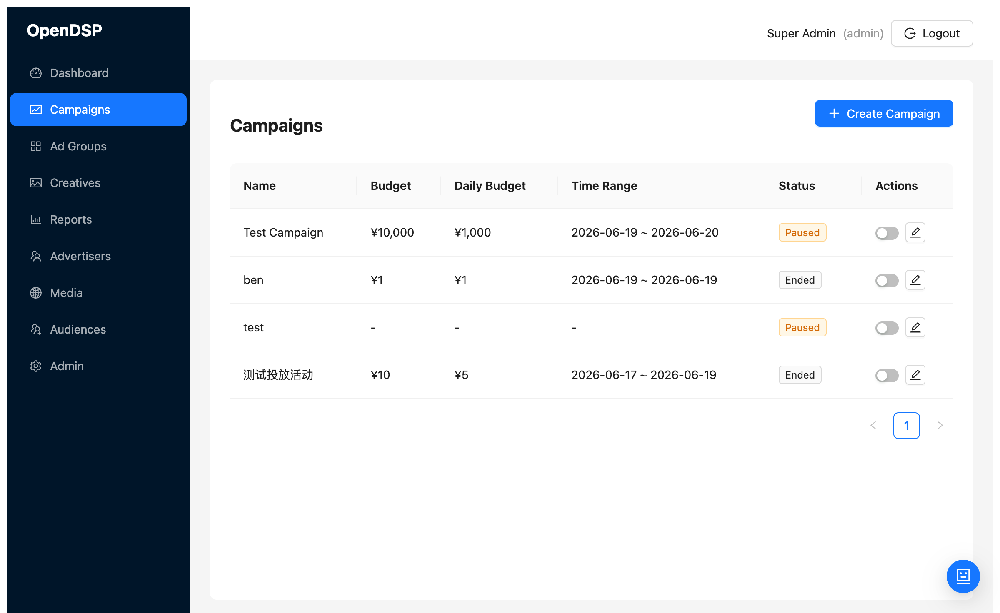
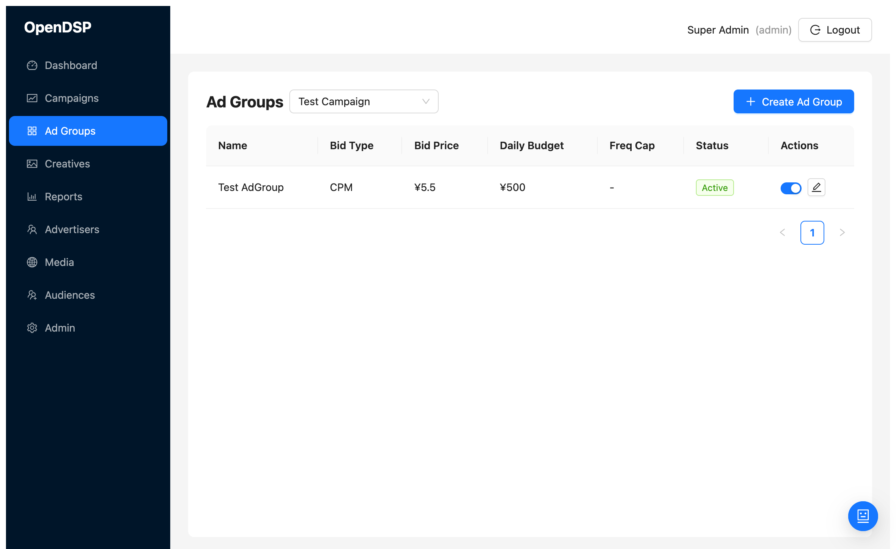
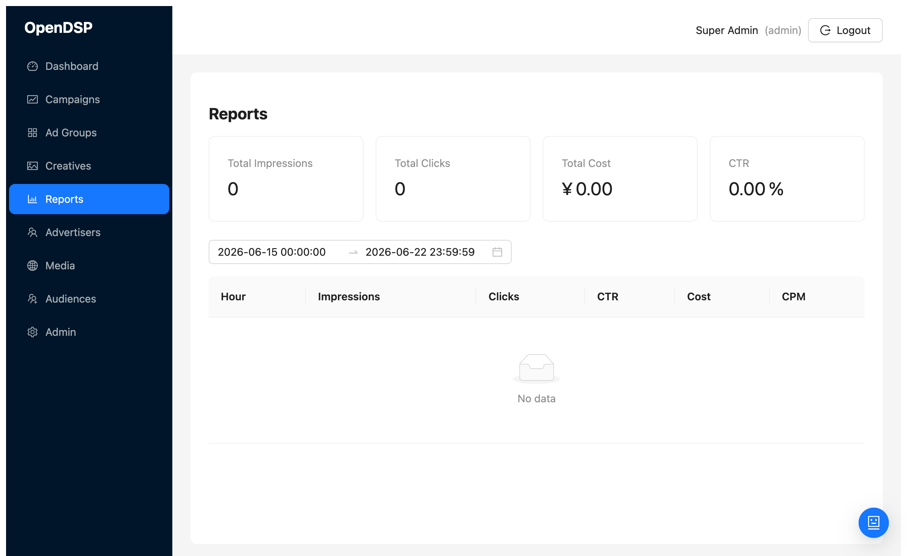
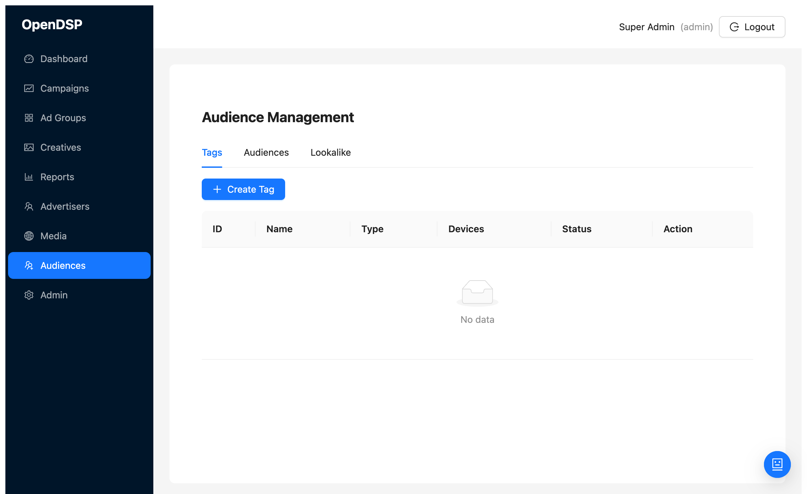

# OpenDSP

An open-source Demand-Side Platform (DSP) built with Go and React, featuring real-time bidding, DMP audience engine, AI assistant, and multi-platform ad management.

## Architecture

```
┌──────────────┐  ┌──────────────┐  ┌──────────────┐  ┌──────────────┐
│  ad-server   │  │  ad-manager  │  │  ad-syncer   │  │ file-gateway │
│   :8080      │  │  :8081/9091  │  │  (worker)    │  │  :9001/9092  │
│  bidding     │  │  CRUD + AI   │  │  index sync  │  │  S3 proxy    │
└──────┬───────┘  └──────┬───────┘  └──────┬───────┘  └──────┬───────┘
       │                 │                 │                 │
       └────────┬────────┴────────┬────────┴────────┬────────┘
                │                 │                 │
         ┌──────┴──────┐  ┌──────┴──────┐  ┌──────┴──────┐
         │ PostgreSQL  │  │   Redis 7   │  │  SeaweedFS  │
         │     16      │  │             │  │   (S3)      │
         └─────────────┘  └─────────────┘  └─────────────┘
```

| Service | Port | Description |
|---------|------|-------------|
| **ad-server** | 8080 | Real-time bidding engine (OpenRTB + iQiyi), impression/click tracking, attribution |
| **ad-manager** | 8081 (HTTP) / 9091 (gRPC) | Management API, DMP, AI assistant, report aggregation |
| **ad-syncer** | — | Background index builder, platform sync scheduler |
| **file-gateway** | 9001 (HTTP) / 9092 (gRPC) | File upload/download proxy (S3/LocalFS backends) |
| **frontend** | 3001 | React SPA (Vite dev server) |

## Screenshots

### Dashboard


### Campaigns


### Ad Groups


### Reports


### Audiences (DMP)


## Features

### Core DSP
- **Real-time bidding** — OpenRTB 2.5 + iQiyi protobuf adapters, <100ms latency
- **Roaring Bitmap inverted index** — multi-dimension ad matching (media, position, geo, os, device, time, audience)
- **Frequency control** — Redis Lua atomic scripts for impression capping
- **VAST 3.0** — XML builder with click_id embedded in impression/click URLs
- **Attribution** — click_id-based conversion tracking, MMP postbacks (Adjust, AppsFlyer)
- **Budget management** — campaign/adgroup-level daily/total budgets with pacing

### DMP (Data Management Platform)
- **Tag Store** — Roaring Bitmap device collections persisted in Redis
- **Audience Resolver** — nested AND/OR/EXCLUDE rule DSL
- **Lookalike Engine** — cosine similarity expansion from seed audiences
- **Behavior Collector** — hourly aggregation from impression/click/conversion events

### AI Assistant
- **Chat Widget** — floating panel with SSE streaming, Function Calling (15 tools)
- **Dashboard Insights** — today vs yesterday comparison, pacing alerts
- **Report Anomalies** — CTR outlier detection with warning markers
- **Write Operations** — budget/bid/status changes with user confirmation

### Management
- **Campaigns** — CRUD, status toggle, budget/pacing, detail drawer with 7-day trend
- **Ad Groups** — CRUD, bid type/price, frequency cap, targeting JSON, detail drawer
- **Creatives** — CRUD, file upload, auto-audit, platform sync (iQiyi)
- **Advertisers** — CRUD, qualification audit, proof materials, balance/recharge
- **Media** — media sources and ad positions management
- **Admin** — user management, role-based access, audit queue

### Infrastructure
- **gRPC + gRPC-Gateway** — dual gRPC/REST API with camelCase JSON
- **JWT auth** — HMAC-SHA256 tokens with role-based access (admin/operator/viewer)
- **Prometheus metrics** — bid requests, gRPC latency, AI calls, active sessions
- **PostgreSQL partitioning** — stat_event monthly partitions with auto-cleanup
- **Docker Compose** — full dev environment (9 services)

## Quick Start

### Prerequisites
- Go 1.25+
- Docker & Docker Compose
- pnpm (for frontend)

### Development

```bash
# Start all services
make docker-up

# Or start individually
docker compose up -d postgres redis seaweedfs
make run-server   # ad-server on :8080
make run-manager  # ad-manager on :8081
make run-syncer   # background worker
make run-gateway  # file-gateway on :9001

# Frontend (dev mode with HMR)
cd web && pnpm install && pnpm run dev
```

### Default Credentials

| Service | URL | Credentials |
|---------|-----|-------------|
| Frontend | http://localhost:3001 | admin@opendsp.io / admin123 |
| SeaweedFS Admin | http://localhost:9333 | — |
| Grafana | http://localhost:3000 | admin / admin |
| Prometheus | http://localhost:9092 | — |

### AI Assistant Setup

```bash
export LLM_API_KEY=sk-your-key-here
export LLM_MODEL=gpt-4o-mini  # default
# Optional: use DeepSeek
export LLM_BASE_URL=https://api.deepseek.com/v1
export LLM_MODEL=deepseek-chat
```

Set `AI_ENABLED=false` to disable the AI assistant entirely.

## Tech Stack

| Layer | Technology |
|-------|-----------|
| **Language** | Go 1.25 |
| **Frontend** | React 19 + Ant Design 5 + TypeScript 6 |
| **Database** | PostgreSQL 16 (sqlc for type-safe queries) |
| **Cache** | Redis 7 |
| **Storage** | SeaweedFS (S3-compatible) |
| **API** | gRPC + gRPC-Gateway (protobuf) |
| **Auth** | JWT (HMAC-SHA256) |
| **Metrics** | Prometheus + Grafana |
| **Index** | Roaring Bitmap v2 |
| **Build** | Docker Compose (dev) / K8s Helm (prod) |

## Project Structure

```
opendsp/
├── cmd/                    # Service entry points
│   ├── ad-server/          # Bidding engine
│   ├── ad-manager/         # Management API + AI
│   ├── ad-syncer/          # Index sync worker
│   └── file-gateway/       # File proxy
├── internal/
│   ├── ai/                 # LLM client, chat, tools, insights
│   ├── biz/                # Domain models, use cases, repo interfaces
│   ├── data/               # PostgreSQL repos, sqlc-generated queries
│   ├── dmp/                # Tag store, audience resolver, lookalike
│   ├── freq/               # Frequency capping & budget control
│   ├── index/              # Roaring Bitmap inverted index
│   ├── middleware/          # Auth, RBAC, logging, recovery
│   ├── service/
│   │   ├── adserver/       # Engine, tracker, attribution, adapters
│   │   ├── admanager/      # CRUD services, DMP API, sync, audit
│   │   └── filegateway/    # Upload receiver, file proxy
│   └── storage/            # S3/LocalFS backends
├── proto/                  # Protobuf definitions
├── gen/                    # Generated protobuf Go code
├── queries/                # sqlc query definitions
├── migrations/             # PostgreSQL migrations
├── web/                    # React frontend
│   └── src/
│       ├── components/     # EntityDrawer, AIChat
│       ├── pages/          # 11 page components
│       └── services/       # API client
├── deploy/                 # Helm charts, Prometheus config
├── docker-compose.yml
├── Dockerfile
└── Makefile
```

## License

MIT
